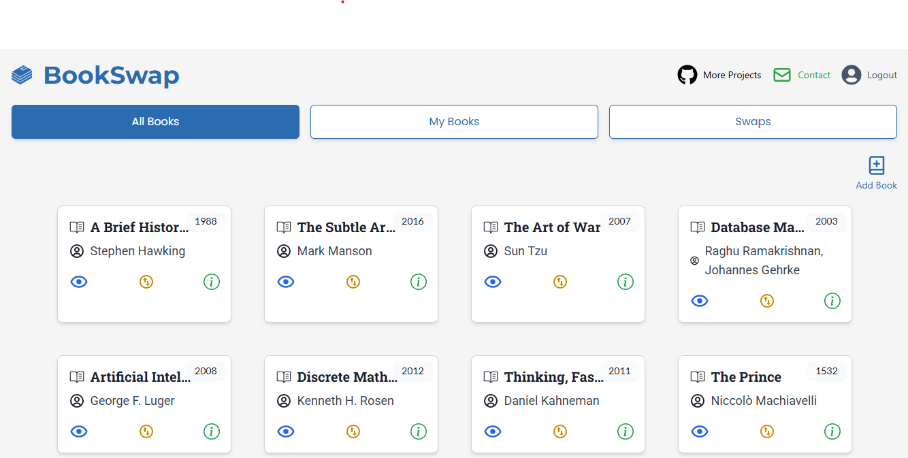
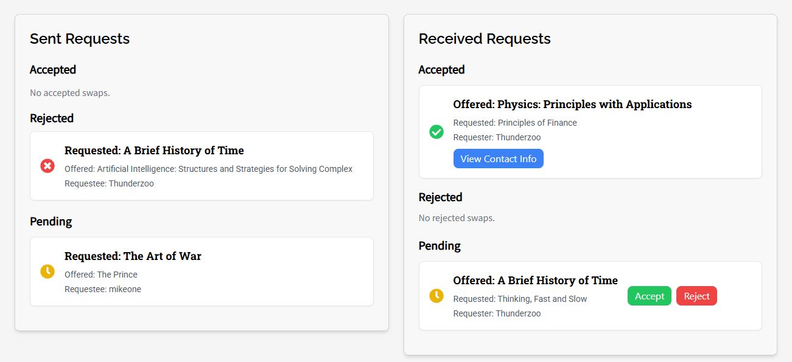

# BookSwap

BookSwap is a full-stack web application built using the MERN (MongoDB, Express, React, Node.js) stack. It allows users to list, search, and swap books with other users. The app is deployed on Vercel.

## Features
- User authentication and profile management
- List books for swapping
- Search and browse available books
- Request and manage book swaps
- Real-time notifications
- Responsive UI built with React

## Tech Stack
- **Frontend**: React, Vite, Tailwind CSS
- **Backend**: Node.js, Express.js, MongoDB
- **Authentication**: JWT (JSON Web Token)
- **Hosting**: Vercel (Frontend), MongoDB Atlas (Database)

## Installation

### Prerequisites
- Node.js and npm installed
- MongoDB Atlas or a local MongoDB instance

### Backend Setup
```sh
cd backend
npm install
npm start
```

### Frontend Setup
```sh
cd frontend
npm install
npm run dev
```

## Deployment
- The frontend is deployed on Vercel: [BookSwap on Vercel](https://book-swap-qk6r.vercel.app/).
- The backend is also deployed on Vercel.

## API Endpoints
- `POST /api/auth/login` - User login
- `POST /api/auth/register` - User registration
- `GET /api/books` - Fetch all available books
- `POST /api/swaps/request` - Request a book swap

## Screenshots
Here are some screenshots of the project:

### Home Page
The landing page where users can browse and discover books available for swapping.




### Book Swapping
A section choose which of your books you will trade.


### Swap Requests Page
An interface allowing users to see sent and recieved book requests.




## Contributing
Feel free to fork the repository and open pull requests for new features or bug fixes.

## License
This project is licensed under the MIT License.


